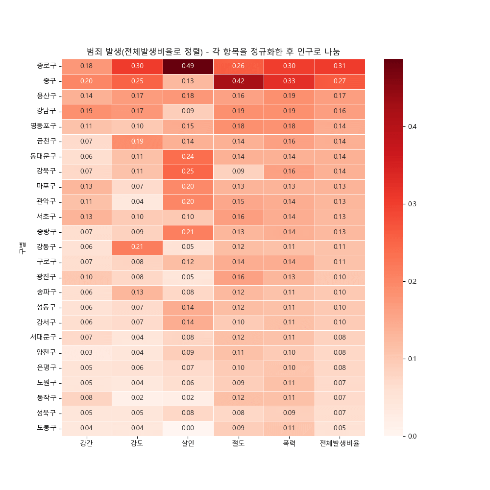
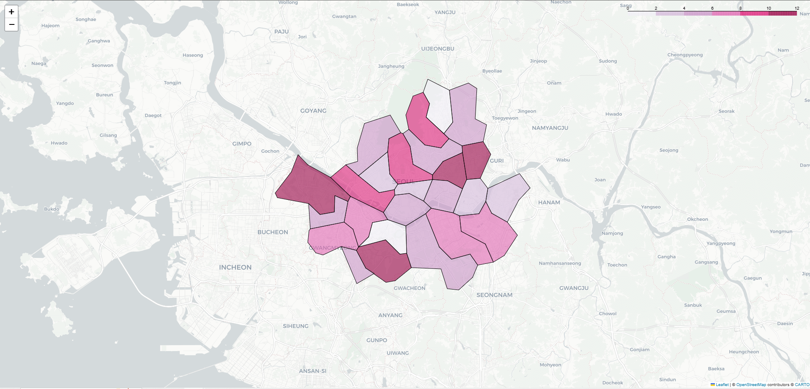

# 🕵️‍♂️ 서울시 범죄 분석 프로젝트 (Seoul Crime Analysis)

 <br/>
 <br/>
[](https://github.com/team-no-1/seoul-crime-analysis/actions/workflows/python-package-conda.yml)<br/><br/>

## 📋 목차
- [소개](#-소개)
- [프로젝트 특징](#-프로젝트-특징)
- [설치 방법](#-설치-방법)
- [사용 방법](#-사용-방법)
- [지도 보기](#-지도-보기)
- [프로젝트 구조](#-프로젝트-구조)
- [결과 예시](#-결과-예시)
  - [범죄 발생 히트맵](#-범죄-발생-히트맵)
  - [인터랙티브 범죄 지도](#-인터랙티브-범죄-지도)
- [라이선스](#-라이선스)
- [팀원 소개](#-팀원-소개)<br/><br/>

## 🌟 소개
서울시의 관서별 5대 범죄 발생 및 검거 데이터를 활용하여 범죄 현황을 분석하고, 시각화 도구를 통해 인사이트를 제공하는 프로젝트입니다. 이를 통해 지역별 범죄 패턴을 파악하고, 안전한 도시 조성에 기여하고자 합니다.<br/><br/>

## 🚀 프로젝트 특징
- **데이터 수집 및 전처리**
  - 다양한 출처의 데이터를 수집하고, 분석에 적합한 형태로 전처리합니다.
- **데이터 통합**
  - 범죄 데이터와 인구 데이터를 결합하여 인구 대비 범죄율을 분석합니다.
- **데이터 분석**
  - 검거율 계산, 정규화, 인구 대비 범죄 비율 등을 통해 심층적인 분석을 수행합니다.
- **데이터 시각화**
  - 히트맵과 인터랙티브 지도를 생성하여 시각적으로 이해하기 쉽게 표현합니다.
- **모듈화된 코드 구조**
  - 클래스별 모듈화로 유지보수와 확장성이 용이합니다.<br/><br/>

## 🛠 설치 방법<br/>
### 1. 사전 요구 사항
- Python 3.10 이상
- Anaconda 또는 Miniconda 설치 권장<br/>
### 2. 저장소 클론

```bash
git clone https://github.com/team-no-1/seoul-crime-analysis.git
cd seoul-crime-analysis
```

### 3. Conda 환경 설정
```bash
conda env create -f environment.yml
conda activate seoul-crime-analysis
```

### 4. 의존성 설치
모든 필요한 패키지는 environment.yml에 정의되어 있습니다.<br/><br/>

## 📝 사용 방법
메인 스크립트를 실행하여 데이터를 분석하고 시각화합니다:<br/><br/>

## 📌 지도 보기
seoul_crime_map.html 파일을 웹 브라우저로 열어 인터랙티브 지도를 확인하세요.<br/><br/>

## 📂 프로젝트 구조
```bash
seoul-crime-analysis/
├── data/
│   ├── 관서별 5대범죄 발생 및 검거.xlsx
│   ├── pop_kor.csv
│   └── skorea_municipalities_geo_simple.json
├── images/
│   ├── seoul_skyline.jpg
│   ├── heatmap_example.png
│   └── map_example.png
├── main.py
├── modules/
│   ├── CrimeDataLoader.py
│   ├── CrimeDataMerger.py
│   ├── CrimeDataAnalyzer.py
│   └── CrimeDataVisualizer.py
├── .gitignore
├── environment.yml
├── README.md
├── LICENSE
└── tests/
    └── test_main.py
```

- **data/:** 데이터 파일들이 위치하는 디렉토리<br/>
- **images/:** README 및 결과물에 사용되는 이미지<br/>
- **modules/:** 기능별 클래스 모듈<br/>
- **tests/:** 유닛 테스트 코드<br/><br/>

## 🌈 결과 예시<br/>
## 📊 범죄 발생 히트맵
구별 범죄 발생 비율을 히트맵으로 표현한 예시입니다.
<p align="center">  </p>

## 🗺 인터랙티브 범죄 지도
Folium을 활용하여 제작한 서울시 범죄 현황 지도입니다.
<p align="center">  </p>

## 📄 라이선스
이 프로젝트는 MIT 라이선스에 따라 배포됩니다. 자세한 내용은 LICENSE 파일을 확인해주세요.<br/><br/>
## 👥 팀원 소개
| 이름     | 역할             |
| -------- | ---------------- | 
| 최종환   | 공백 | 
| 신다혜   | 공백 | 
| 유영신   | 공백 | 
| 김동완   | 공백 | 
| 김기정   | 공백 | 
